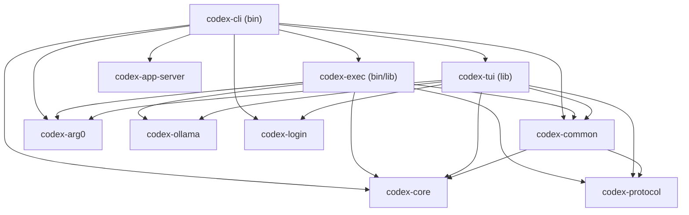

# Codex Frontend Dependency Graph

## Data Source
- `cargo tree -p codex-cli --depth 2`
- `cargo tree -p codex-exec --depth 2`
- `cargo tree -p codex-tui --depth 2`

## High-Level Relationships

## Notes
- **Shared core**: both the interactive (`codex-tui`) and headless (`codex-exec`) frontends depend on `codex-core` for conversation/session management and execution pipelines.
- **CLI multiplexer**: the primary `codex` binary (`codex-cli`) embeds both frontends; it dispatches to `codex-tui` when no subcommand is given and to `codex-exec` for `codex exec`.
- **Runtime helpers**: `codex-arg0` provides arg0-based dispatch used by both binaries to expose additional entrypoints (e.g., Seatbelt/Linux sandbox).
- **Protocol layer**: `codex-protocol` and `codex-common` carry shared configuration structures, ensuring consistent CLI flags across binaries.
- **Model setup**: OSS model bootstrap lives in `codex-ollama`, which is pulled by both frontends when `--oss` is enabled.
- **App integrations**: `codex-cli` alone depends on higher-level tools such as `codex-app-server` and login helpers to expose additional subcommands beyond the two core frontends.
